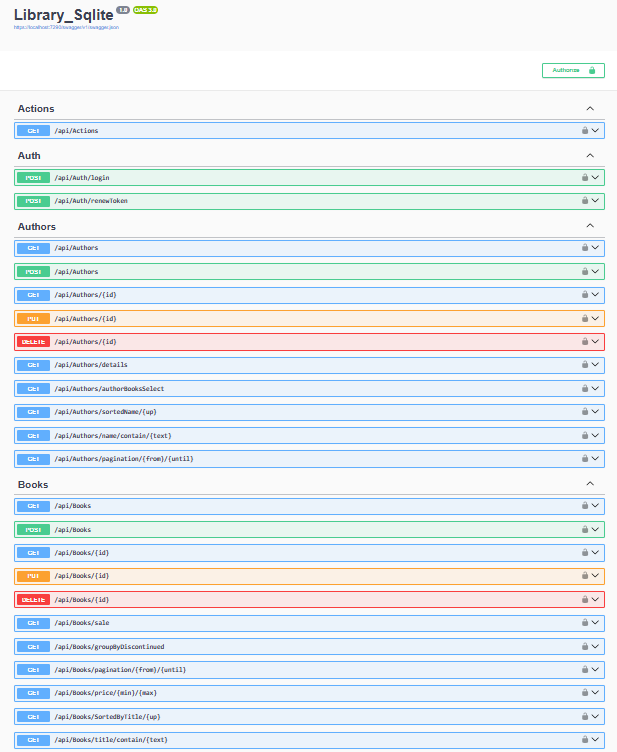
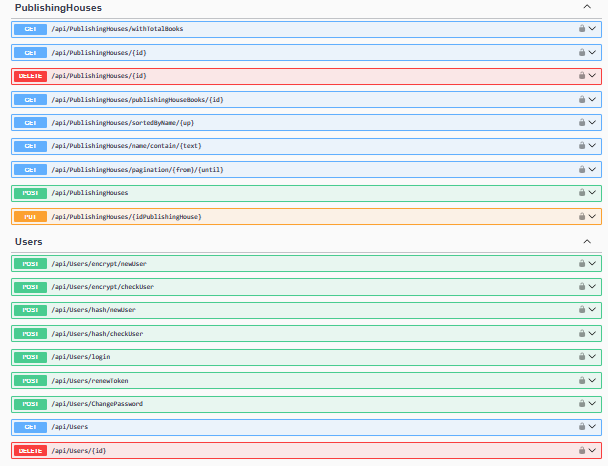
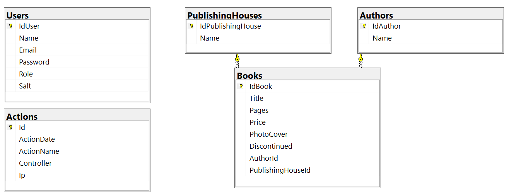

## Library_Sqlite

**Library_Sqlite** is an ASP.NET Core Web API that manages library-related information, including authors, books, and publishing houses, as well as handling user authentication and logging actions performed on the system.


Library_Sqlite/  
│  
├── AutoMappers/  
│   └── MappingProfile.cs  
│  
├── Classes/  
│   └── HashResult.cs  
│  
├── Controllers/  
│   ├── ActionsController.cs  
│   ├── AuthController.cs  
│   ├── AuthorsController.cs  
│   ├── BooksController.cs  
│   ├── PublishingHousesController.cs  
│   └── UsersController.cs  
│  
├── DTOs/  
│   ├── AuthorBookDTO.cs  
│   ├── AuthorDTO.cs  
│   ├── AuthorInsertDTO.cs  
│   ├── AuthorUpdateDTO.cs  
│   ├── BookDTO.cs  
│   ├── BookGroupDTO.cs  
│   ├── BookInsertDTO.cs  
│   ├── BookItemDTO.cs  
│   ├── BookSaleDTO.cs  
│   ├── BookUpdateDTO.cs  
│   ├── LoginResponseDTO.cs  
│   ├── PublishingHouseBookAuthorDTO.cs  
│   ├── PublishingHouseBookDTO.cs  
│   ├── PublishingHouseDTO.cs  
│   ├── PublishingHouseInsertDTO.cs  
│   ├── PublishingHouseUpdateDTO.cs  
│   ├── UserChangePasswordDTO.cs  
│   └── UserDTO.cs  
│  
├── Models/  
│   ├── Action.cs  
│   ├── Author.cs  
│   ├── Book.cs  
│   ├── LibraryContext.cs  
│   ├── PublishingHouse.cs  
│   └── User.cs  
│  
├── Repository/  
│   ├── AuthorRepository.cs  
│   ├── BookRepository.cs  
│   ├── IAuthorRepository.cs  
│   ├── IBaseRepository.cs  
│   ├── IBookRepository.cs  
│   ├── IPublishingHouseRepository.cs  
│   └── PublishingHouseRepository.cs  
│  
├── Services/  
│   ├── ActionsService.cs  
│   ├── AuthorService.cs  
│   ├── BookService.cs  
│   ├── HashService.cs  
│   ├── IAuthorService.cs  
│   ├── IBookService.cs  
│   ├── ICommonServiceBase.cs  
│   ├── IManagerFiles.cs  
│   ├── IPublishingHouseService.cs  
│   ├── ITokenService.cs  
│   ├── ManagerFiles.cs  
│   ├── PublishingHouseService.cs  
│   └── TokenService.cs  
│  
├── Validators/  
│   ├── AuthorInsertValidator.cs  
│   ├── AuthorUpdateValidator.cs  
│   ├── BookInsertValidator.cs  
│   ├── BookUpdateValidator.cs  
│   ├── GroupFileType.cs  
│   ├── NonNegativePagesValidation.cs  
│   ├── PublishingHouseInsertValidator.cs  
│   ├── PublishingHouseUpdateValidator.cs  
│   ├── ValidationFileType.cs  
│   └── WeightFileValidation.cs  
│  
├── appsettings.json  
├── library.db   
└── Program.cs  





## Program
```cs 
var connectionString = builder.Configuration.GetConnectionString("Connection");

builder.Services.AddDbContext<StoreContext>(options =>
    options.UseSqlite(connectionString);
);
``` 

## appsetting.Development.json
```cs 
{
  "ConnectionStrings": {
    "Connection": "Data Source=library.db"
  }
}
``` 



[DeepWiki moraisLuismNet/Library_Sqlite](https://deepwiki.com/moraisLuismNet/Libray_Sqlite)


