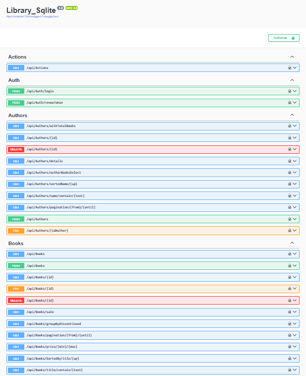

## Library_Sqlite
ASP.NET Core Web API Biblioteca




## appsetting.Development.json
``` 
{
    "Logging": {
        "LogLevel": {
            "Default": "Information",
            "Microsoft.AspNetCore": "Warning"
        }
    },
    "EncryptionKey": "",
    "JWTKey": "",
    "AllowedHosts": "*",
    "ConnectionStrings": {
        "Connection": "Data Source=library.db"
    }
}

``` 
